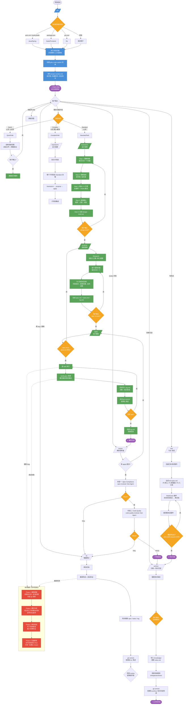

# gfeu-code-copilot 业务项目使用流程图

```mermaid
flowchart TD
    Start(["项目启动"]) --> Init[/init/]
    Init --> Detect{自动检测技术栈}
    Detect -->|"pom.xml / build.gradle"| Java["Java/Spring"]
    Detect -->|"package.json"| Node["Node/Frontend"]
    Detect -->|"go.mod"| Go["Go"]
    Detect -->|"其他"| Manual["询问用户"]
    Java --> Scan["执行项目扫描<br/>识别模块 & 分层架构"]
    Node --> Scan
    Go --> Scan
    Manual --> Scan
    Scan --> CreateDir["创建 gfeu-code-copilot/ 目录"]
    CreateDir --> FillContext["填充 project-context.md<br/>技术栈 / 构建命令 / 测试命令"]
    FillContext --> Ready(["✅ 初始化完成<br/>可用流程菜单"])

    Ready --> UserInput{用户输入}
    UserInput -->|"需求/功能开发"| Complexity{判断档位}
    UserInput -->|"修 bug / 报错"| FixFlow
    UserInput -->|"review 代码"| ReviewFlow
    UserInput -->|"写测试"| TestFlow
    UserInput -->|"纯技术讨论"| DirectAnswer["直接回答"]
    UserInput -->|"归档/沉淀"| ArchiveFlow

    Complexity -->|"Quick<br/>≤1天 <5文件"| QuickPath
    Complexity -->|"Standard<br/>1-5天"| StandardPath
    Complexity -->|"Complex<br/>>5天 跨3+模块"| ComplexPath

    QuickPath --> QuickScope["说明变更范围<br/>涉及文件 + 预期改动"]
    QuickScope --> QuickConfirm{用户确认?}
    QuickConfirm -->|"是"| QuickExec["直接执行编码"]
    QuickConfirm -->|"否"| UserInput

    StandardPath --> Brainstorm[/brainstorm<br/>设计探索/]
    Brainstorm --> BStep1["Step 1: 理解意图<br/>每次只问一个问题"]
    BStep1 --> BStep2["Step 2: 探索现状<br/>读代码 / 找约束"]
    BStep2 --> BStep3["Step 3: 提出 2-3 方案<br/>含推荐 + YAGNI 裁剪"]
    BStep3 --> BStep4["Step 4: 逐段确认<br/>需求→方案→风险"]
    BStep4 --> BStep5["Step 5: 生成 design-brief.md"]
    BStep5 --> BriefConfirm{用户确认<br/>design-brief?}
    BriefConfirm -->|"否"| BStep1
    BriefConfirm -->|"是"| Propose

    ComplexPath --> CBrainstorm[/brainstorm<br/>设计探索/]
    CBrainstorm --> CSplit["拆分子项目"]
    CSplit --> SubEach["每个子项目走 Standard 流程"]
    SubEach --> SubBrainstorm["brainstorm → propose → apply"]
    SubBrainstorm --> Integration["子项目集成"]

    Propose[/propose<br/>变更提案/] --> PStep1["Research<br/>找到入口类 / 核心链路"]
    PStep1 --> PStep3["逐个澄清问题<br/>每次只问一个"]
    PStep3 --> PStep4["分三段生成文档<br/>代码现状→变更范围→技术决策"]
    PStep4 --> PStep5["生成 spec.md + tasks.md + log.md"]
    PStep5 --> SpecConfirm{用户确认<br/>spec & tasks?}
    SpecConfirm -->|"否"| PStep3
    SpecConfirm -->|"是"| Apply

    Apply[/apply<br/>执行编码/] --> CheckSpec{spec.md &<br/>tasks.md 存在?}
    CheckSpec -->|"否"| Propose
    CheckSpec -->|"是"| ExecTask["逐 task 执行"]
    ExecTask --> Verify["Verification 铁律<br/>展示编译/测试输出"]
    Verify --> WriteLog["实时写入 log.md<br/>决策 + 知识发现"]
    WriteLog --> GitCommit["自动 git commit<br/>变更名 简述"]
    GitCommit --> MoreTasks{还有 task?}
    MoreTasks -->|"是"| ExecTask
    MoreTasks -->|"否"| FillLog["回填 log.md<br/>变更信息"]
    FillLog --> ExecDone(["✅ 编码完成"])

    ExecDone --> ReviewFlow[/review<br/>两阶段审查/]
    ReviewFlow --> ReviewCheck{有 apply 提交?}
    ReviewCheck -->|"否"| Apply
    ReviewCheck -->|"是"| SpecReview["阶段一: Spec Compliance<br/>spec-reviewer Sub-Agent"]
    SpecReview --> SpecPass{PASS?}
    SpecPass -->|"FAIL"| FixFlow
    SpecPass -->|"是"| CodeReview["阶段二: Code Quality<br/>code-quality-reviewer Sub-Agent"]
    CodeReview --> CodePass{PASS?}
    CodePass -->|"FAIL"| FixFlow
    CodePass -->|"PASS"| ReviewDone(["✅ 审查通过"])

    FixFlow[/fix<br/>增量修正/] --> FixExec["修改代码"]
    FixExec --> FixVerify["编译检查 + 测试验证"]
    FixVerify --> FixLog["同步更新 spec / tasks / log"]
    FixLog --> FixCommit["git commit<br/>变更名 fix: 简述"]
    FixCommit --> FixDone{回到 review<br/>或继续开发}

    TestFlow[/test<br/>TDD 测试/] --> TestRun["先跑已有测试套件"]
    TestRun --> TestSpec["生成 test-spec.md<br/>P0 核心 / P1 数据层 / P2 入口层"]
    TestSpec --> RedGreen["Red/Green 循环<br/>先写失败测试 → 再实现"]
    RedGreen --> FullRun["跑完整测试套件"]
    FullRun --> Coverage{覆盖率达标?<br/>stmt ≥80% branch ≥70%}
    Coverage -->|"否"| RedGreen
    Coverage -->|"是"| TestDone(["✅ 测试完成"])

    ReviewDone --> ArchiveFlow
    TestDone --> ArchiveFlow
    ArchiveFlow[/archive<br/>归档 + 知识沉淀/] --> ExtKnowledge["提取知识条目"]
    ExtKnowledge --> ConfirmKnowledge{用户确认<br/>沉淀哪些?}
    ConfirmKnowledge --> SaveKnowledge["写入 knowledge/<br/>更新 index.md"]
    SaveKnowledge --> MoveArchive["变更目录移至<br/>changes/archives/"]
    MoveArchive --> ArchiveCommit["git commit<br/>变更名 archive: 知识沉淀完成"]
    ArchiveCommit --> Done(["✅ 全流程完成"])

    ExecTask -.->|"遇到 bug"| DebugFlow
    Verify -.->|"测试失败"| DebugFlow
    FixVerify -.->|"编译失败"| DebugFlow
    
    subgraph DebugFlow ["自动触发: 四阶段调试"]
        direction TB
        D1["Phase 1 根因调查<br/>读错误日志 / 复现步骤<br/>检查 git 变更"]
        D2["Phase 2 模式分析<br/>找正常工作的类似代码<br/>逐项对比差异"]
        D3["Phase 3 假设验证<br/>写下具体假设<br/>最小变更验证"]
        D4["Phase 4 实施修复<br/>先写复现测试 Red<br/>只改一处确认 Green"]
        D1 --> D2 --> D3 --> D4
    end

    classDef initNode fill:#4A90D9,stroke:#2E6BA6,color:#fff
    classDef processNode fill:#5BA55B,stroke:#3D8B3D,color:#fff
    classDef decisionNode fill:#F5A623,stroke:#D4891A,color:#fff
    classDef doneNode fill:#9B59B6,stroke:#7D3C98,color:#fff
    classDef debugNode fill:#E74C3C,stroke:#C0392B,color:#fff

    class Init,Scan,CreateDir,FillContext initNode
    class Brainstorm,BStep1,BStep2,BStep3,BStep4,BStep5,Propose,PStep1,PStep3,PStep4,PStep5,Apply,ExecTask,Verify,WriteLog,GitCommit,FillLog,QuickExec processNode
    class Detect,Complexity,BriefConfirm,SpecConfirm,CheckSpec,MoreTasks,SpecPass,CodePass,Coverage,ConfirmKnowledge decisionNode
    class Ready,ExecDone,ReviewDone,TestDone,Done doneNode
    class D1,D2,D3,D4 debugNode
```
