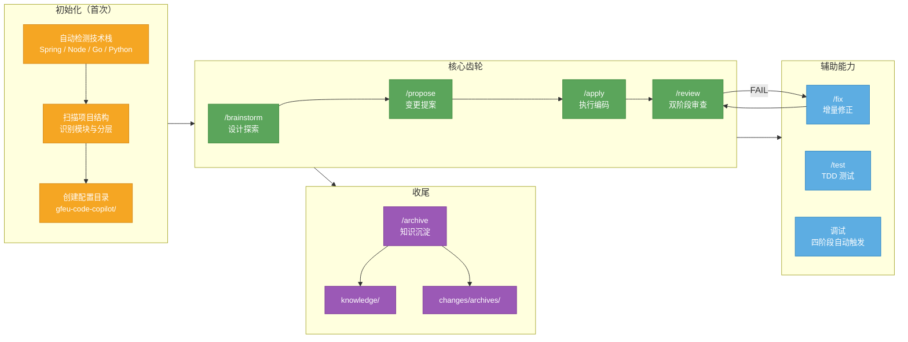

# gfeu-code-copilot — 业务项目使用全景图

## 一分钟讲清楚

| 阶段 | 一句话 | 产出 |
| --- | --- | --- |
| **/init** | 自动识别你的项目，配置协作环境 | `gfeu-code-copilot/` 目录 |
| **/brainstorm** | 先聊清楚再动手，避免写错方向 | `design-brief.md` |
| **/propose** | 写规格说明书，明确改什么、怎么改 | `spec.md` + `tasks.md` |
| **/apply** | 按 spec 逐个 task 编码，每个都有证据验证 | 代码 + `log.md` |
| **/review** | 先查有没有按 spec 实现，再查代码质量 | 审查报告 |
| **/fix** | review 发现问题就修，修完再审 | 修复代码 |
| **/test** | Red/Green 循环，覆盖率 ≥ 80% | 测试用例 |
| **/archive** | 把踩过的坑沉淀成知识，下次自动加载 | `knowledge/` |
